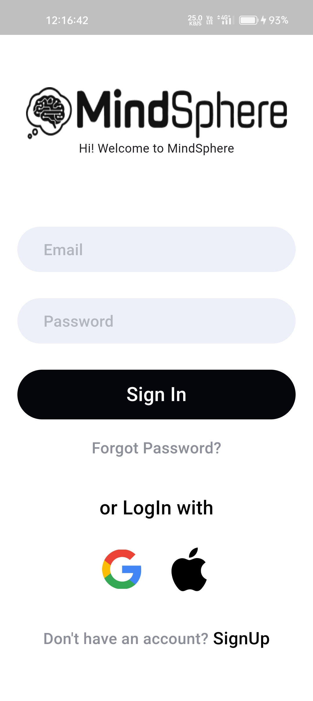
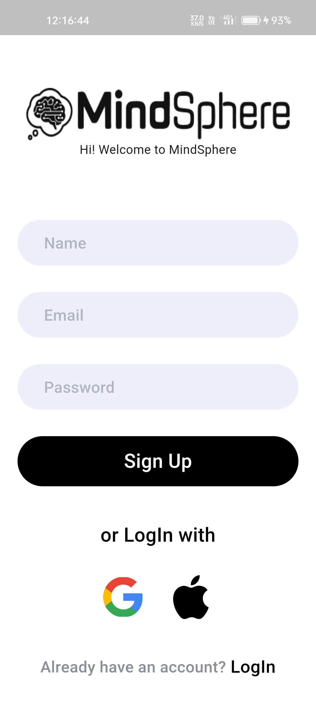
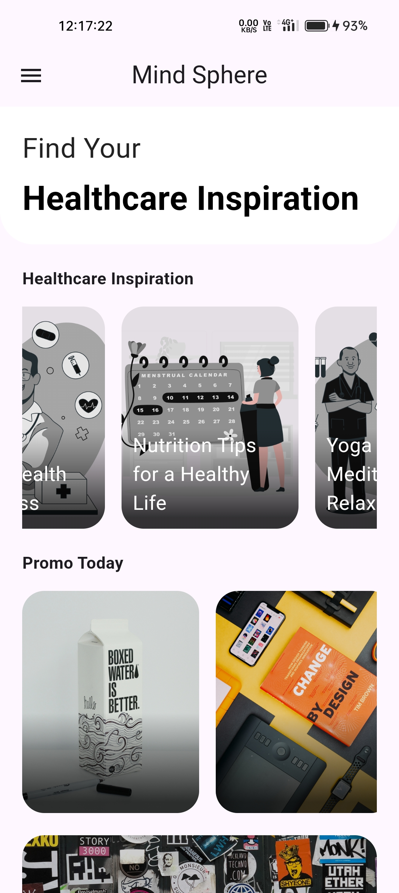
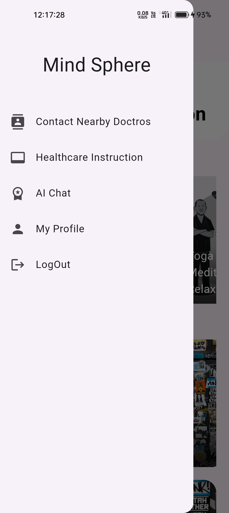
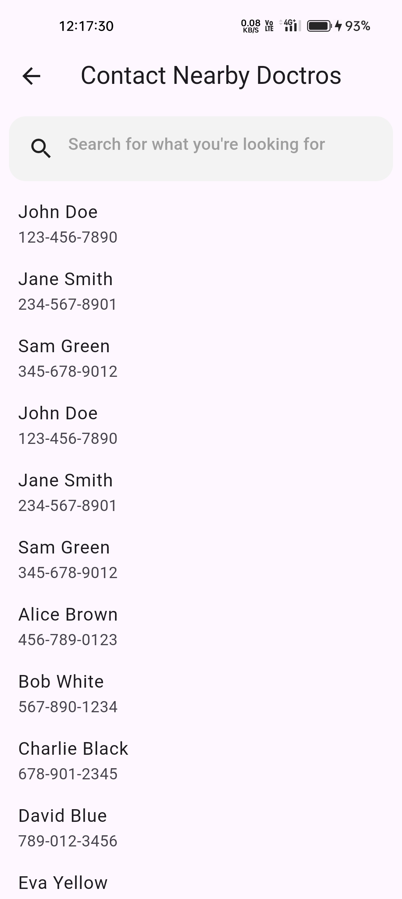
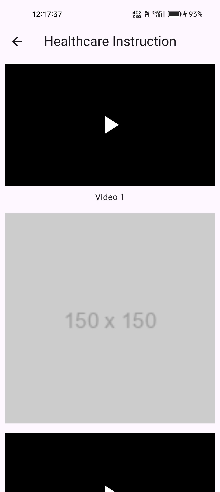
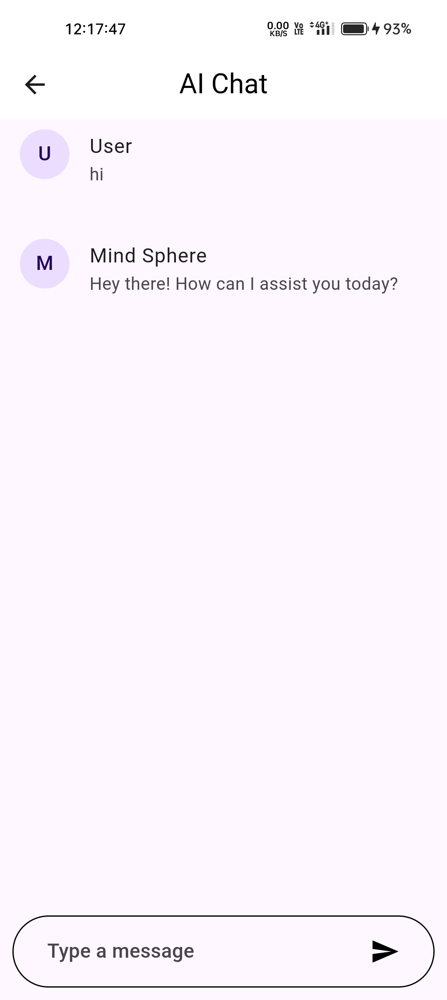

# [Mind Sphere App](https://youtube.com/shorts/1Q0ffhgId78)

## Overview

Mind-Sphere is an innovative healthcare app designed to enhance mental well-being through AI-powered insights and real-time support. Built using **Flutter** and **Firebase**, the app allows users to connect with nearby doctors, access mental health resources, and benefit from personalized AI-driven recommendations.


---

## Features

- **AI-Powered Insights**: Get personalized suggestions to improve mental health.  
- **Doctor Finder**: Locate and contact nearby doctors effortlessly.  
- **Real-Time Support**: Chat with mental health professionals or AI assistants.  
- **Secure Data Storage**: Powered by Firebase for seamless and secure data management.  
- **User-Friendly Interface**: Intuitive design for all age groups.  
- **Cross-Platform**: Available on Android and iOS devices.

---

## Screenshots

<a></a>
<a></a>
<a></a>
<a></a>
<a></a>
<a></a>
<a></a>
<a></a>

---

## Getting Started

This project is a starting point for a Flutter application.

### Prerequisites

- Flutter SDK installed.  
- Firebase setup for your application.  
- Any IDE like Android Studio, VSCode, or IntelliJ IDEA.

### Installation

1. Clone the repository:  
   ```bash
   git clone https://github.com/your-repo/mind-sphere.git
   cd mind-sphere
   ```

2. Install dependencies:  
   ```bash
   flutter pub get
   ```

3. Run the app:  
   ```bash
   flutter run
   ```

---

## Resources

If you're new to Flutter development, these resources can help you get started:

- [Lab: Write your first Flutter app](https://docs.flutter.dev/get-started/codelab)  
- [Cookbook: Useful Flutter samples](https://docs.flutter.dev/cookbook)

For help with Firebase, check the [official Firebase documentation](https://firebase.google.com/docs/).

---

## Connect

<a href="https://dev-aryanbhimani.pantheonsite.io/" target="_blank"></a>  
<a href="https://www.linkedin.com/in/aryanbhimani/" target="_blank"></a>  
<a href="https://twitter.com/yourtwitterhandle" target="_blank"></a>

---

### Contact

For queries or support, feel free to reach out:  
📞 **+91 9408962204**  
📧 **aryan.bhimani.93@email.com**

---
